<!-- _class: lead -->

# Working with Coding Agents
## Foundations and Guardrails

*The Remix — Byron Bay*

---

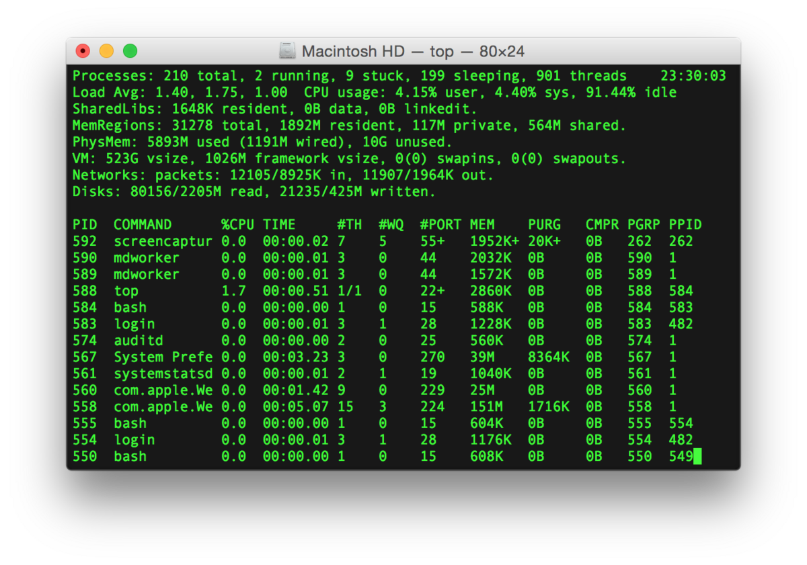

---

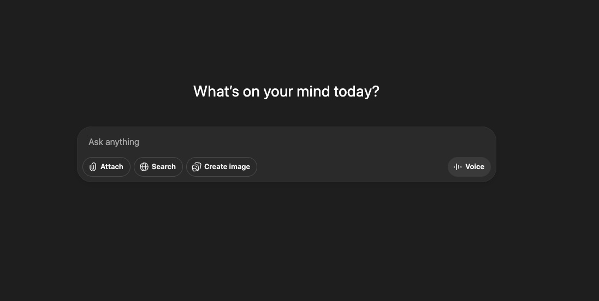

---

## Today

**1. The Timeline** — where things are heading and why using these tools right now is huge leverage

**2. What is a Coding Agent?** — we'll actually setup an agent here, so the rest will make more sense

**3. What are your options** for working with coding agents?

**4. Setup a Coding Agent** — actually create a project

**5. What's next (April)**

---


---

<!-- _class: question -->

Anyone want to share?

---

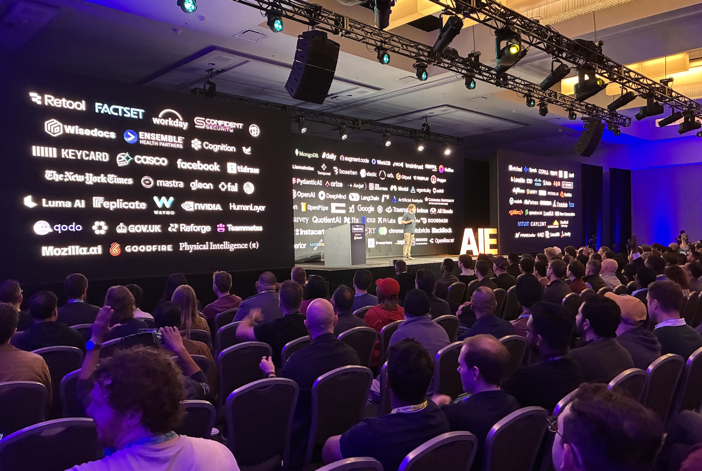

---

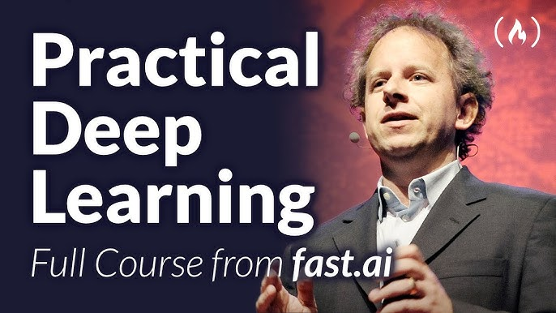

---

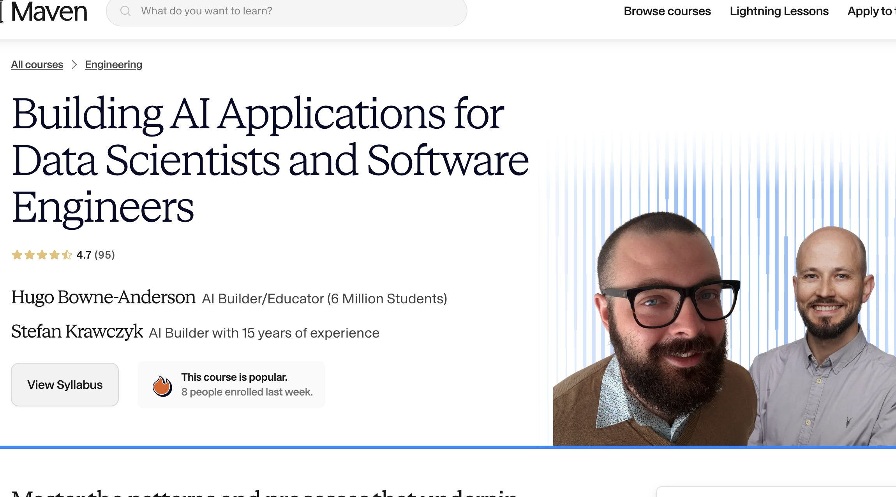

---

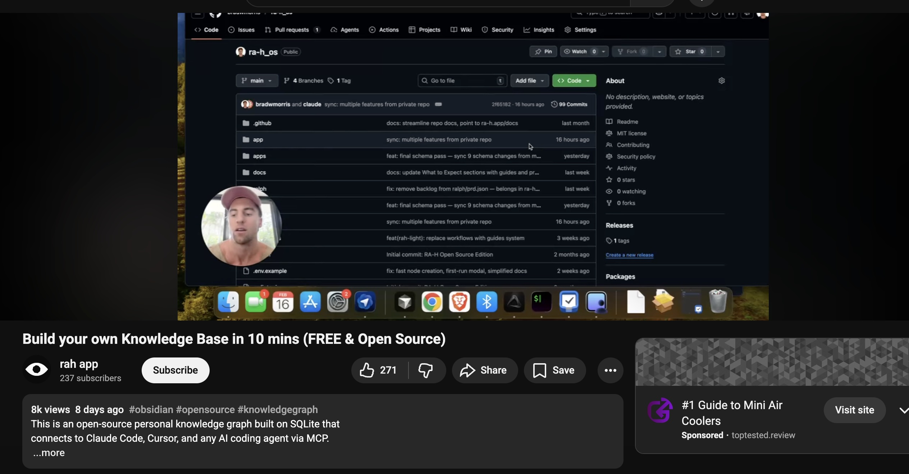

---

## tldr: Why this is such a big fckng deal?

- AI writes code (predictable structure)
- Runs it instantly (knows if it works)
- Fixes and retries (in seconds)

**+ Basic computer access = AI does <span class="highlight">*most*</span> of the work humans do on a computer.**

---

<!-- _class: lead -->

# 1. The Timeline

Where things are heading — and why you need to be paying attention


---

These tools are reshaping work and the entire economy right now. <span class="highlight">Learning how to use them is huge leverage.</span>

---

## The METR Benchmark

Time horizon of software tasks LLMs can complete — from minutes to hours. The curve is going vertical.

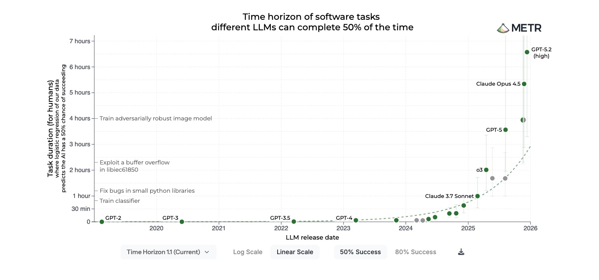

---

## Model Performance: Approaching Expert-Level

Claude Opus 4.1 achieves 47.6% win rate vs. industry professionals — nearing parity.

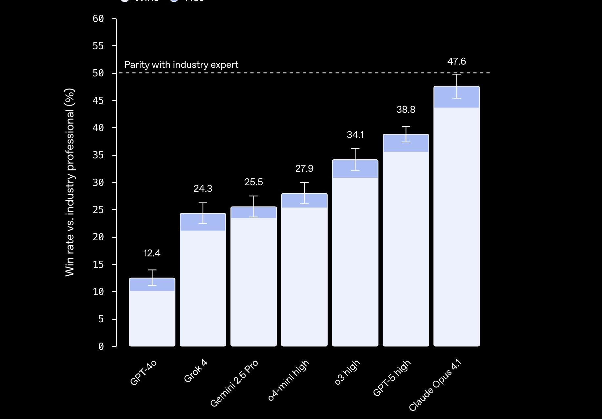

---

## $1 Trillion Wiped from Software Stocks

Nicolas Bustamante — 10 years building vertical SaaS.


---

## traditional saas is NGMI - new models will emerge

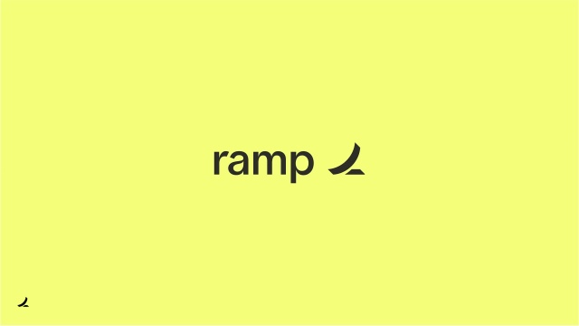 

---

## Karpathy: Software 1.0 vs 2.0

*"Software 1.0 easily automates what you can **specify**. Software 2.0 easily automates what you can **verify**."*


---

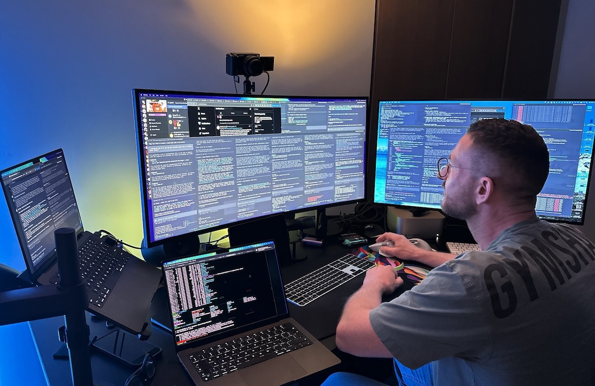

---

## "AI is starting to kill us all, Colin Robinson style"

People are overworking because of AI. Not replacing us — supercharging the pace.

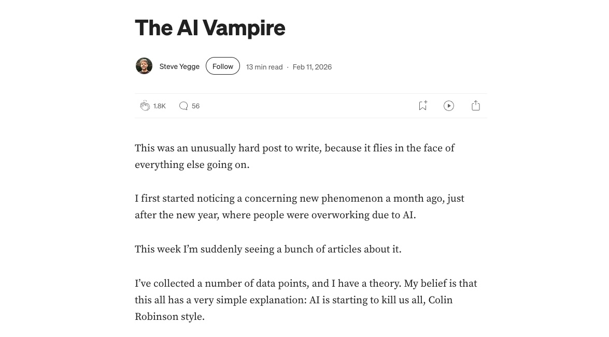

---

<small>"theory of mind/agency/collaboration" - these models will make some people 10x more capable, and MOST people significantly more stupid"</small>

---

find the middle path

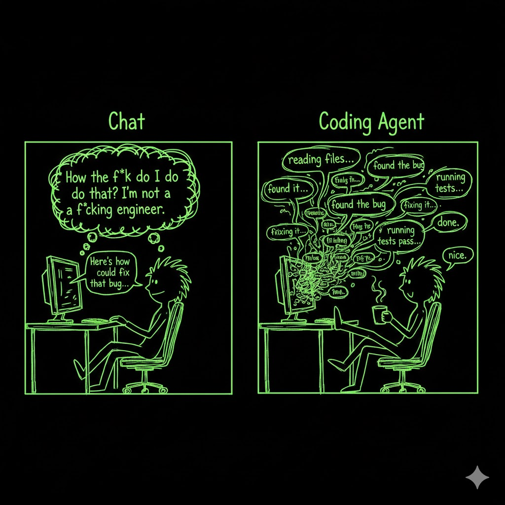

---

- [ ] Ask for examples, counterexamples, and boundaries
- [ ] Force it to expose assumptions
- [ ] Treat answers as drafts, not conclusions
- [ ] Use it to clarify your thinking, not replace it

---

<!-- _class: question -->

What shifts are you seeing in your workspace, your team, your industry?

---

<!-- _class: lead -->

# 2. What is a Coding Agent?

The anatomy and the landscape


---

## Step 1: Get Ghostty

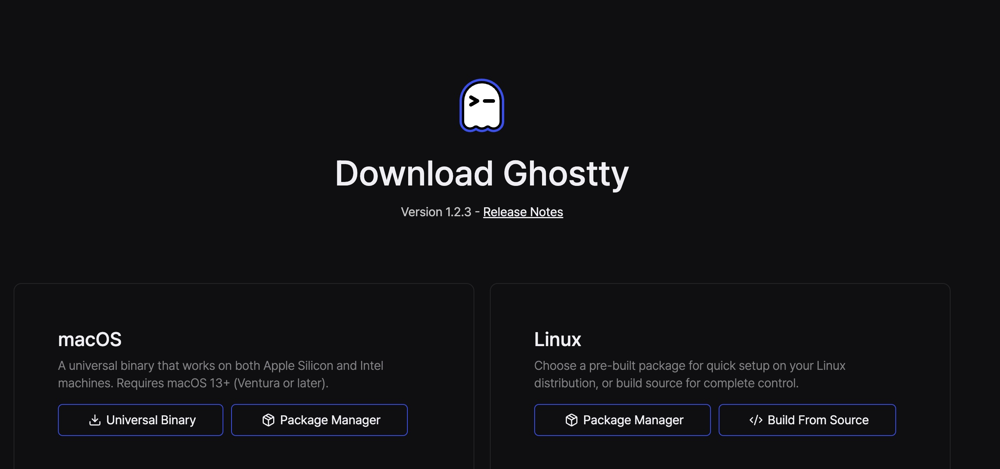

---

## Step 2: Install

Go to [opencode.ai](https://opencode.ai/) — copy the install command. Open your terminal and paste it:

```bash
curl -fsSL https://opencode.ai/install | bash
```

Then close your terminal and reopen it.

---

## Step 3: Pick a Model

Inside Open Code:

- Type `/models` — pick a model (there are free ones)

---

## Step 4: Ask It This

Paste this prompt and watch it work:

> *"Create a project on my Desktop. Do a web search to understand what a coding agent is and what a coding harness is. Then build me something interactive to help me learn the basics of both concepts. Make sure to explain what a coding agent does and how a harness works."*

---

## Step 5: Now Make It Personal

Think about what you would have your Einstein assistants do. Ask it:

> *"Explain to me how I might use a coding agent to help me with [the verifiable, repetitive tasks in my work], so I can focus more on [the creative, high-taste elements]. Give me specific examples."*

---

<!-- _class: question -->

Anyone want to have a guess at what 'harness' means?

---

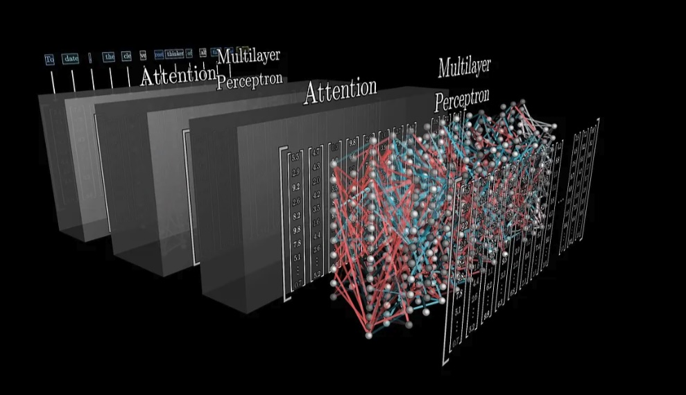

---

## Creating a 'coding agent'

**1.** Pre-training — base model, "expensive autocomplete"
**2.** Post-training — SFT + RLHF, "the assistant"
**3.** Reasoning — inference-time compute, let it think
**4.** Tool use + agentic loop — give it hands, let it act

<span class="highlight">**5. The harness — the tools, the loop, the guardrails**</span>

*\*This is crude oversimplification*

---

## Different Approaches

🅾️ **OpenAI** — built a dedicated coding model. Specialised brain.

🔵 **Anthropic** — same general model, smarter harness. Same brain, different workshop.

🟢 **Kimi Code (Moonshot AI)** — open-source harness, open-weight model. Same idea as Anthropic, but everything is open.

---

## The harness is the product — and the secret sauce is 'largely' in the system message

> *"At their core is an AI model, but wrapped around it is a mix of code, tools, and prompts: the harness."*

Drew Breunig & Srihari Sriraman — *How System Prompts Define Agent Behavior* (Feb 2026)

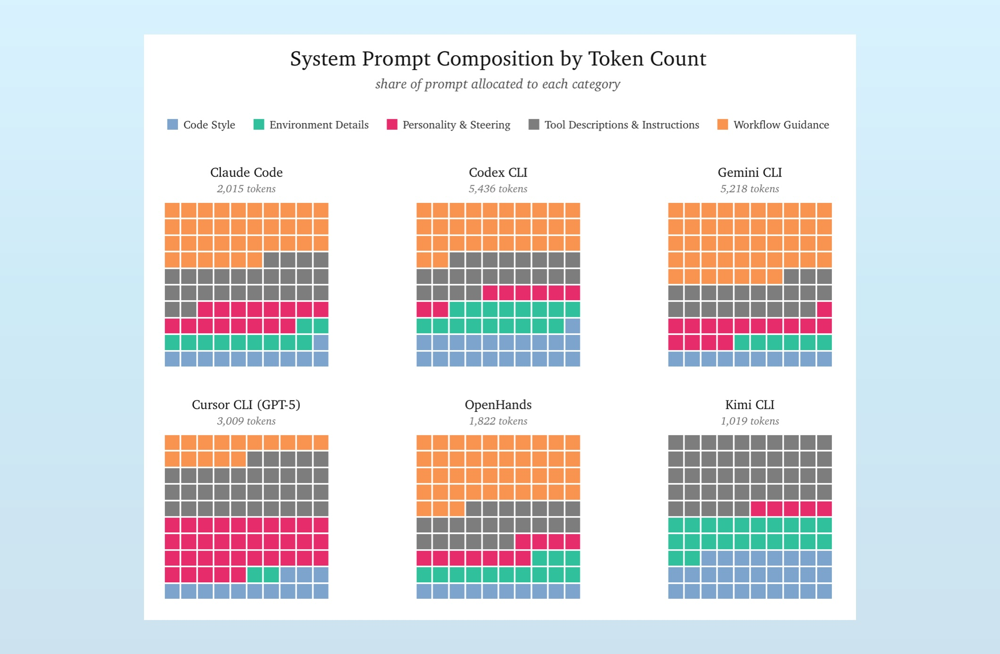

---

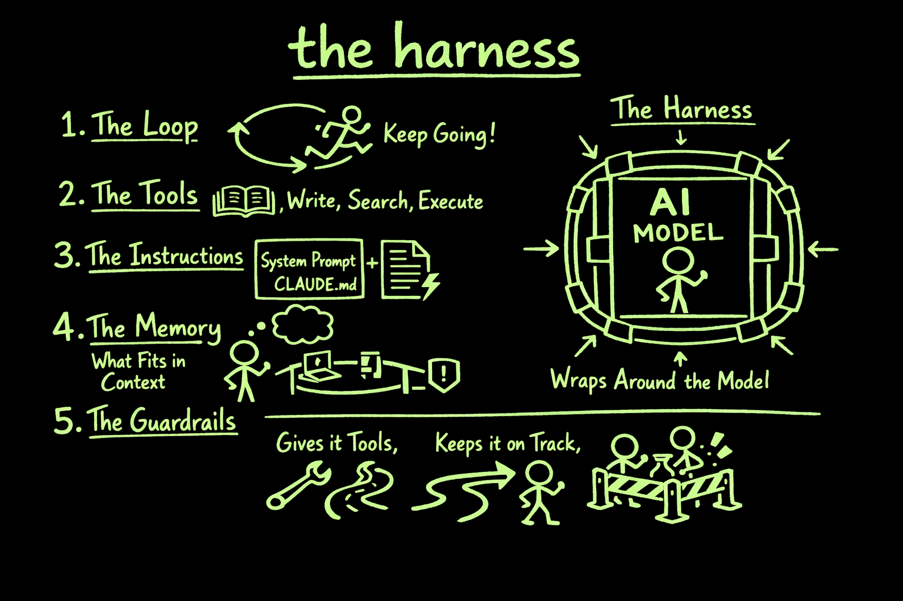

---

A harness is the wrapper around the model that gives it tools, keeps it on track, and stops it from breaking things.

---

<!-- _class: question -->

Who has used/is using these coding tools? Would anyone like to share their current setup?

---

<!-- _class: question -->

Anyone else like to share their AI workflow or other agentic tools they're using?

---

<!-- _class: lead -->

# 3. What are the options?

The wrapper that turns a model into a coding agent


---

## At a Glance

| | **Claude Code** | **Cursor** | **Codex** | **Open Code** |
|---|---|---|---|---|
| **Where** | Terminal | IDE (VS Code) | Cloud | Terminal |
| **Model** | Claude | Any | OpenAI (codex-1) | Any |
| **Cost** | Pay per use | $20/mo subscription | Pay per use | Free (BYO key) |
| **Best for** | Full autonomy | Visual editing | Background tasks | Experimenting |
| **Skill floor** | Comfortable with terminal | Familiar with VS Code | Minimal | Comfortable with terminal |

---

## Claude Code

Terminal-native. General-purpose Claude models + harness.


---

## Cursor

IDE-based: editor + chat panel. Model-agnostic, multiple providers.

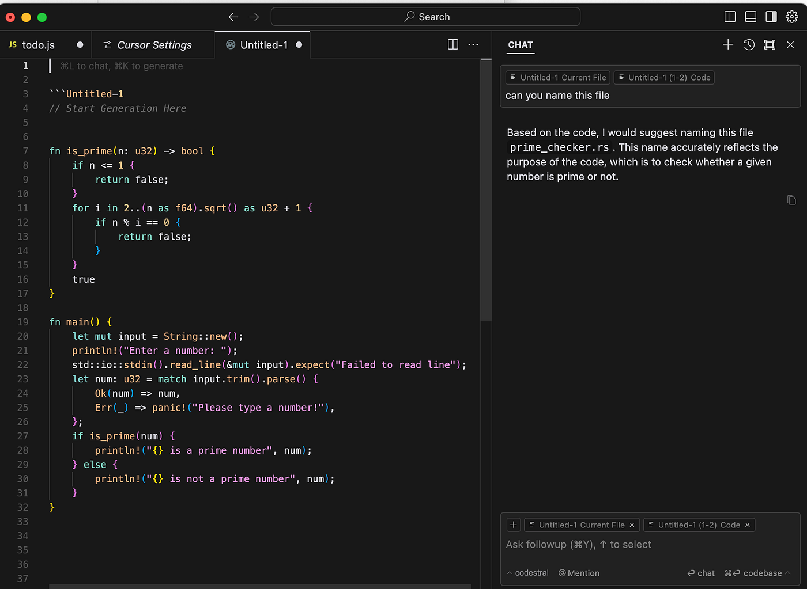

---

## Codex

Cloud sandbox. Dedicated codex-1 model (o3 + RL).

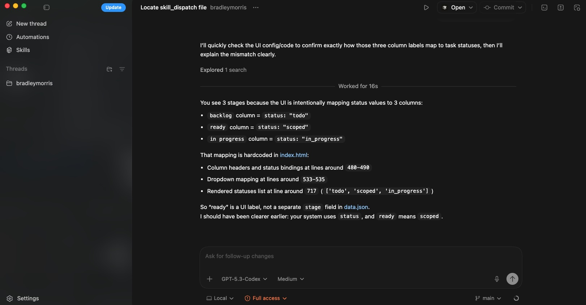

---

## Open Code

Open-source terminal agent. Model-agnostic. Community-driven.

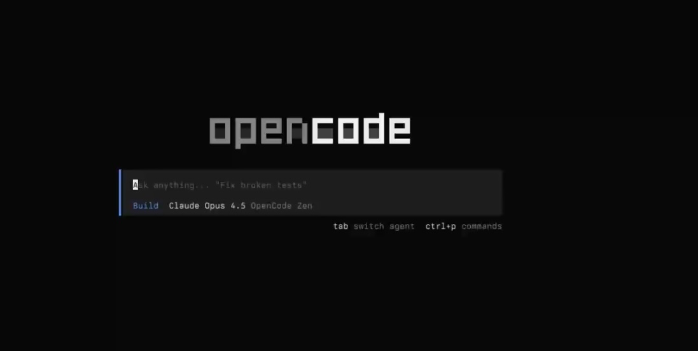

---

## But it's fuzzy...

There are many different products and services built by and integrated with coding agents.

  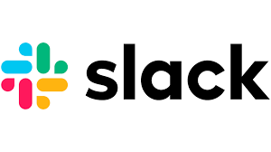

---

<!-- _class: question -->

Any questions?

---

<!-- _class: lead -->

# 4. Setup a Coding Agent

Let's do it live

---

## ⚠️ Before We Install Anything

**The obvious risk:** you're giving a coding agent access to your computer. It can read, write, and delete your files. All of them. It can delete all of your shit.

**The less obvious risk:** prompt injection. If you install extensions or MCP servers you haven't vetted, a malicious instruction can hijack what the agent does — without you realising.

If you plan to keep using this stuff — just spend a couple of hours understanding the risks involved and how to mitigate.

---


---

## OpenCode vs Claude Code

**OpenCode (Open Source)**
- Multi-provider flexibility: Supports 75+ LLM providers (Claude, GPT-4, Gemini, DeepSeek, local models via Ollama, etc.)
- Free models included: Grok Code Fast 1, MiniMax M2.1, GLM 4.7
- GitHub Copilot integration: Use existing Copilot subscription
- Local model support: Run models entirely offline via Ollama
- Multi-session: Run multiple agents in parallel on same project
- Privacy-first: No code/context data stored
- Multiple interfaces: Terminal, desktop app, IDE extensions
- Highly customizable: Themes, keybinds, formatters, custom commands

**Claude Code (Anthropic Official)**
- Single provider: Anthropic's Claude models only (Sonnet, Opus)
- Polished experience: Official product, more stable/refined
- Anthropic ecosystem: Tight integration with Claude's capabilities
- Premium quality: Generally considered best-in-class for professional work
- Vendor lock-in: Requires Anthropic API access

---

## Step 6: Create a Project

```bash
mkdir ~/Desktop/my-first-project
cd ~/Desktop/my-first-project
opencode
```

**Or** — just ask the agent to create it for you.

- `mkdir` = **m**a**k**e **dir**ectory — creates a folder
- `cd` = **c**hange **d**irectory — moves into it

---

## Step 7: Build Something

Paste this prompt and watch it work:

> *"Create a single index.html file with a simple, clean todo list app. I can type a task and press enter to add it. Each task has a checkbox to mark it done and a delete button. Done tasks get a strikethrough. Dark theme, modern looking. All CSS and JS inline."*

---

## Step 8: Open It

Find the `index.html` file in your project folder and double-click it.

It opens in your browser. You just built that.

---

## Step 9: Vibe Away

Now make it yours. Ask the agent to:

- Add confetti when you complete a task 🎉
- Pull in a random motivational quote from the internet
- Make it play a sound when you delete something
- Surprise you

Let it cook. Tell it to search the web for ideas. See what happens.

---

<!-- _class: lead -->

# 5. Build Something (April)

And build it in public

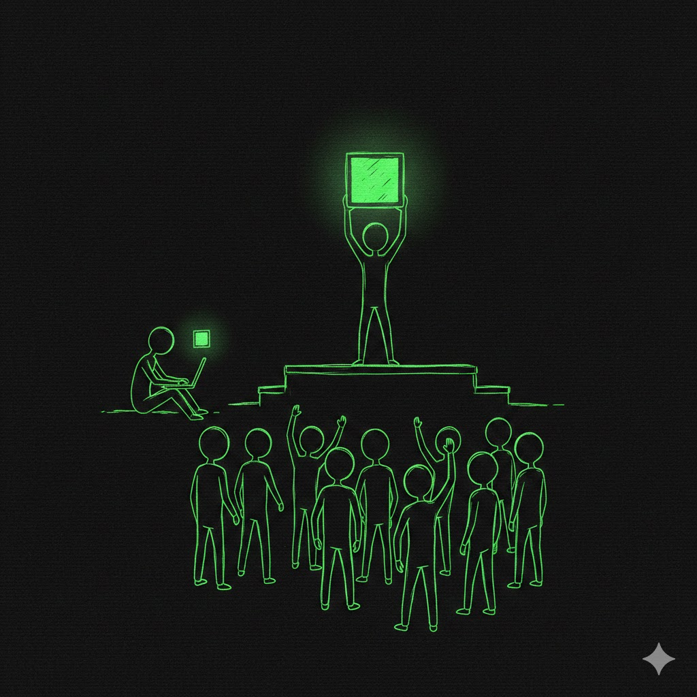

---

## What's Next: April Workshops

Learn to do this in a more refined way:

- **MCP (Model Context Protocol)** — give your agent access to databases, APIs, and tools beyond just files
- **Better prompting** — how to guide an agent on longer, more complex tasks
- **Project setup** — rules files, context, guardrails

Bring something you've already started — or start fresh.

---

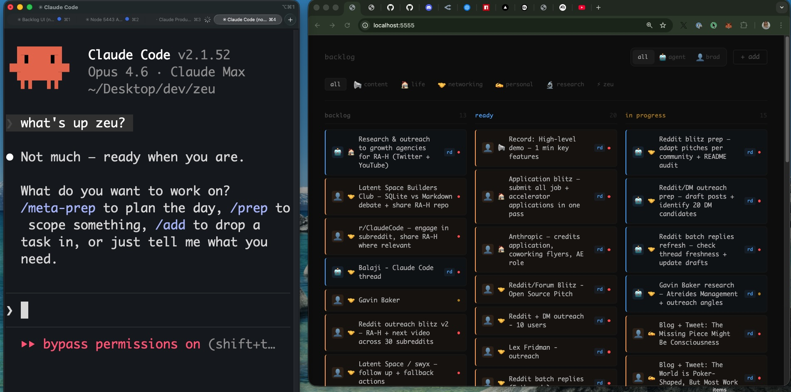

---

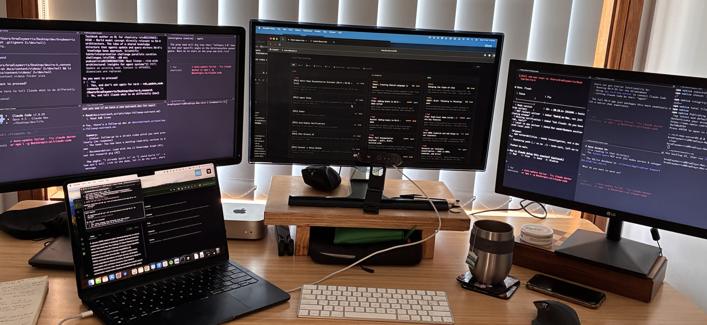

---

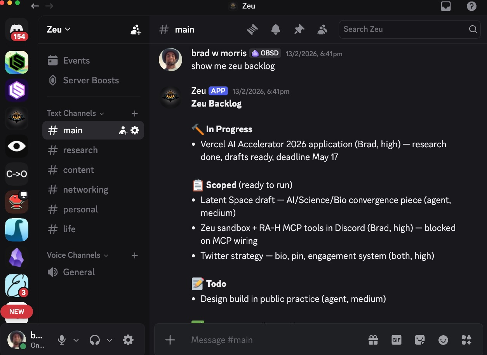

---

<!-- _class: lead -->

# Thanks

Let's build something.

*@bradwmorris*
